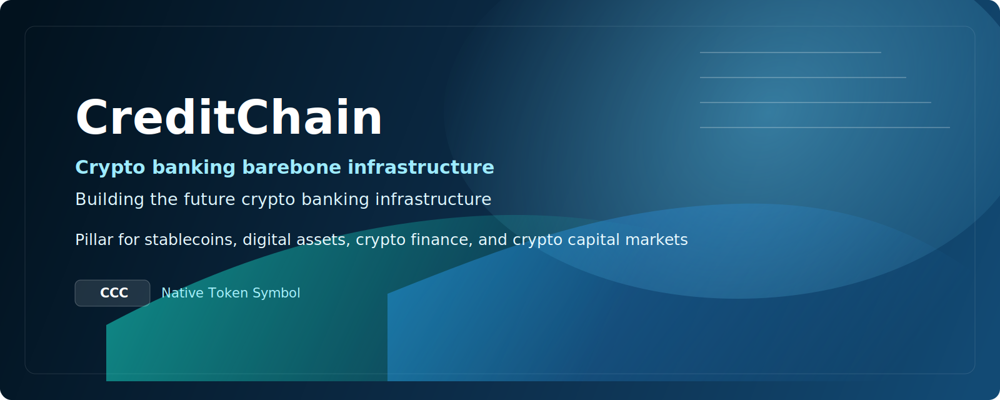

<a href="https://github.com/ibankio/creditchain">
  
</a>

---

[](https://github.com/ibankio/creditchain)
[]()
[]()
[]()
[]()

# CreditChain

CreditChain is the institution-grade Layer 1 public chain designed for stablecoins,
digital asset settlement, cross-chain interoperability, and programmable finance.
It is the settlement backbone of the OpenIBank ecosystem and is packaged as a
complete production surface that includes the chain, the Creditscan explorer,
the CreditChain TypeScript SDK, and the docs portal.

## Product Surfaces

| Surface | Role | Primary Audience |
|--------|------|------------------|
| **CreditChain Core** | Layer 1 protocol with CCC, Move, Jolteon BFT, and financial modules | Operators, validators, institutions |
| **Creditscan** | Blockchain browser for accounts, blocks, transactions, validators, and analytics | Users, operators, support teams |
| **creditchain-ts-sdk** | TypeScript SDK for data access, transaction building, signing, and submission | Application developers |
| **docs.creditchain.org** | Unified documentation for protocol, explorer, SDK, and website content | Builders, operators, product teams |

## Core Capabilities

### Consensus and execution

- Sub-second optimistic finality with Jolteon BFT
- HotStuff-style safety with DAG-backed transaction ordering
- BlockSTM parallel execution for high-throughput transaction processing
- Noise-based networking and authenticated validator communication

### Smart contracts and safety

- Move smart contracts with resource-oriented programming
- Bytecode verification before execution
- Formal-verification support for critical modules
- Strong account, signature, and multisig primitives inherited from the Libra to Diem to Aptos lineage

### Stablecoin platform

- One-click stablecoin creation through `stablecoin_factory`
- Big 6 native genesis stablecoins: IUSD, IEUR, IJPY, IGBP, ICNY, ICAD
- Cross-stablecoin swaps, reserve attestations, compliance controls, and rate limits
- Settlement, clearing, bridge, oracle, and custody modules for institutional flows

### Deployment flexibility

- Public mainnet for open validator participation
- Consortium deployments for invited financial institutions
- Private enterprise rails for internal treasury and settlement
- Sovereign and hybrid models for regulated national or regional deployments

## Protocol Snapshot

| Property | Value |
|----------|-------|
| Native token | CCC |
| Mainnet chain ID | 0xCC01 (52225) |
| Testnet chain ID | 0xCC02 (52226) |
| Devnet chain ID | 0xCC03 (52227) |
| Consensus | Jolteon BFT |
| Smart contract VM | Move |
| Stablecoins at genesis | IUSD, IEUR, IJPY, IGBP, ICNY, ICAD |

## Architecture

```text
CreditChain Node
  REST API / WebSocket / gRPC indexer
  Mempool and Jolteon consensus
  BlockSTM execution
  Move VM and financial modules
  RocksDB + Jellyfish Merkle Tree storage
  Noise-based validator and fullnode networking
```

## Creditscan And SDK

CreditChain ships with a broader product system around the chain itself:

- **Creditscan**: multi-network explorer with REST and indexer-backed account views,
  validator pages, analytics, and production deployment requirements for Hasura,
  processors, Postgres, and GraphQL.
- **creditchain-ts-sdk**: typed SDK with `CreditChain` and `CreditChainConfig`
  entrypoints for network-aware clients, custom endpoints, transaction building,
  simulation, signing, and submission.

These surfaces are documented together in `docs/07_CREDITSCAN_BROWSER_GUIDE.md`
and `docs/08_TYPESCRIPT_SDK_GUIDE.md`.

## Documentation

The content in `docs/` is intended to back:

- `https://docs.creditchain.org`
- `https://www.creditchain.org/docs`
- the main marketing website in `/Users/wenyan/ClaudeProjects/creditchain-web`

| Document | Description |
|----------|-------------|
| [docs/README.md](docs/README.md) | Docs index and audience guide |
| [docs/01_CREDITCHAIN_ARCHITECTURE.md](docs/01_CREDITCHAIN_ARCHITECTURE.md) | Architecture overview and strategic positioning |
| [docs/02_TOKEN_ECONOMY_REFERENCE.md](docs/02_TOKEN_ECONOMY_REFERENCE.md) | Reference token and genesis model |
| [docs/03_MOVE_MODULES_SPEC.md](docs/03_MOVE_MODULES_SPEC.md) | CreditChain-specific Move modules |
| [docs/04_BRIDGE_AND_INTEROP_SPEC.md](docs/04_BRIDGE_AND_INTEROP_SPEC.md) | Cross-chain bridge and interoperability design |
| [docs/05_DEPLOYMENT_AND_OPERATIONS.md](docs/05_DEPLOYMENT_AND_OPERATIONS.md) | Node, infra, and operator guidance |
| [docs/06_ONE_CLICK_STABLECOIN.md](docs/06_ONE_CLICK_STABLECOIN.md) | Stablecoin factory and platform design |
| [docs/07_CREDITSCAN_BROWSER_GUIDE.md](docs/07_CREDITSCAN_BROWSER_GUIDE.md) | Creditscan browser guide and deployment notes |
| [docs/08_TYPESCRIPT_SDK_GUIDE.md](docs/08_TYPESCRIPT_SDK_GUIDE.md) | TypeScript SDK guide and integration patterns |
| [docs/09_WEBSITE_AND_DOCS_CONTENT_MAP.md](docs/09_WEBSITE_AND_DOCS_CONTENT_MAP.md) | Canonical website and docs content map |

## Quick Start

```bash
# Build from source
cargo build --release -p creditchain-node

# Boot a local 4-validator devnet
cargo run -p creditchain-localnet -- run \
    --num-validators 4 \
    --chain-id 52227 \
    --with-faucet

# Verify node health
curl http://localhost:8080/v1/-/healthy

# Read chain info
curl http://localhost:8080/v1/ | jq .
```

## Repository Guide

| Path | Purpose |
|------|---------|
| [api/README.md](api/README.md) | REST API and OpenAPI generation |
| [config/README.md](config/README.md) | Node and network configuration |
| [consensus/README.md](consensus/README.md) | Jolteon consensus subsystem |
| [execution/README.md](execution/README.md) | Block execution and executor crates |
| [mempool/README.md](mempool/README.md) | Transaction admission and ordering |
| [network/README.md](network/README.md) | Peer connectivity and transport |
| [state-sync/README.md](state-sync/README.md) | State sync and streaming services |
| [storage/README.md](storage/README.md) | Persistent storage and backup layers |
| [sdk/README.md](sdk/README.md) | Rust SDK surface |
| [dashboards/README.md](dashboards/README.md) | Grafana dashboards |
| [protos/README.md](protos/README.md) | Protobuf definitions and code generation |
| [testsuite/README.md](testsuite/README.md) | Test and benchmarking tooling |
| [third_party/README.md](third_party/README.md) | Mirrored upstream dependencies |

## Security

CreditChain uses defense in depth:

- Move type safety and bytecode verification
- BFT consensus safety for validator faults below one-third
- Authenticated networking with encrypted transport
- Formal-verification support for critical on-chain modules
- Multi-signature and account-abstraction primitives

Report security issues through [SECURITY.md](SECURITY.md).

## Contributing

CreditChain is proprietary enterprise infrastructure. Contributions are managed
through the CreditChain Research Team.

- [Contributing guide](CONTRIBUTING.md)
